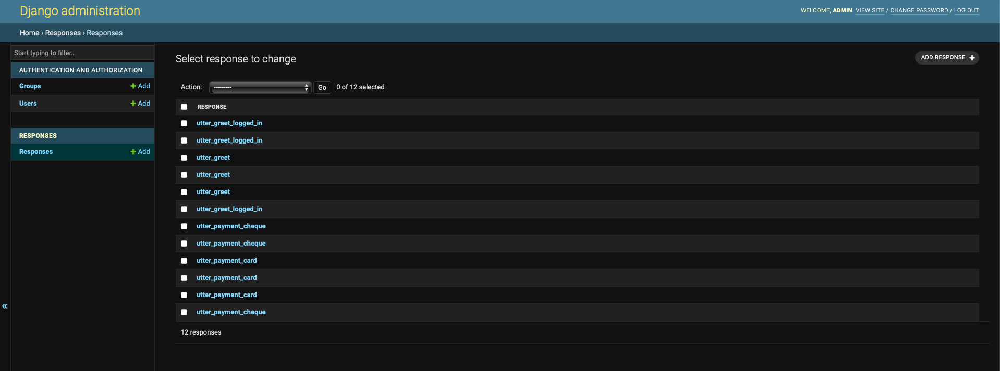

# Rasa NLG Server with Django Answer Store

This is an example project of a Rasa NLG service backed by a simple Django app to store the responses (the answer store).

The Django app includes an endpoint that supports the [Rasa NLG format](https://rasa.com/docs/rasa/nlg/).

To support multiple languages, the endpoint looks for a slot named `language` and will use this to lookup the appropriate response from the database. If there isn't a slot called `language` the endpoint sets the language to `en-US`. You can modify the endpoint to change the slot name or default language setting.

Use the following `endpoints.yml` setting to use this app:

```yml
nlg:
  url: http://127.0.0.1:8000/api/responses/nlg/
```

## Architecture


## Starting the App

```sh
python manage.py createsuperuser # run this to create new admin user
python manage.py runserver
# Browse to http://127.0.0.1:8000/admin and created Rasa responses
```

## Adding Responses

To add responses, open the admin ui at [http://127.0.0.1:8000/admin/responses/response/](http://127.0.0.1:8000/admin/responses/response/)



## Dump Responses Endpoint

You can hit the following endpoint to dump all responses in JSON format:

```sh
curl --location 'http://127.0.0.1:8000/api/responses/'
```

## CRV Version

There's a separate version of this application not provided here that supports processing of custom response variations

### CRV Architecture


